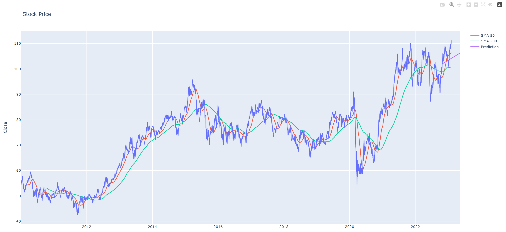

# Monitoring Stock Signals Python

This is a basic test code with simple regression models for stock proediction.
This includes examples to get stock data from Alpha Vantage and yahoo finance.

# Installation
Install the required dependencies:
```
pip install -r requirements.txt
```
# Usage
To run the sample plot program, simply run
```
python main_yahoo_non_linear_predict_sklearn_07.
```



# Contributing
Contributions are welcome! If you find a bug or would like to suggest a new feature, please open an issue or submit a pull request.

# License
This project is licensed under the GPL-3.0 license - see the LICENSE file for details


